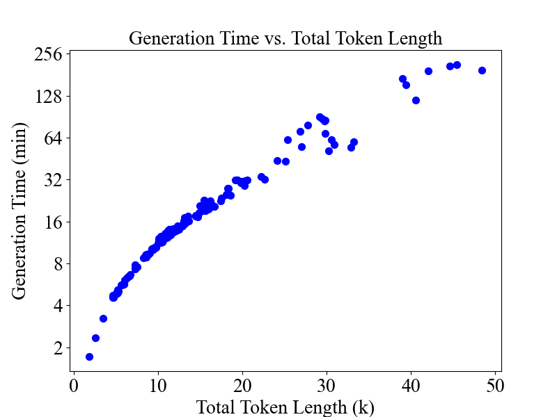

The correlation between total token length (the protein sequence length multiplied by the number of generated MSAs) and the inference time (minutes).

In most cases (total token length < 20K), the generation time of MSAGPT is lower than the AF2 search pipeline requiring more than 30 minutes.

The result shows MSAGPT can generate substantial sequence lengths within practical time, thus affirming its scalability and efficiency. 
